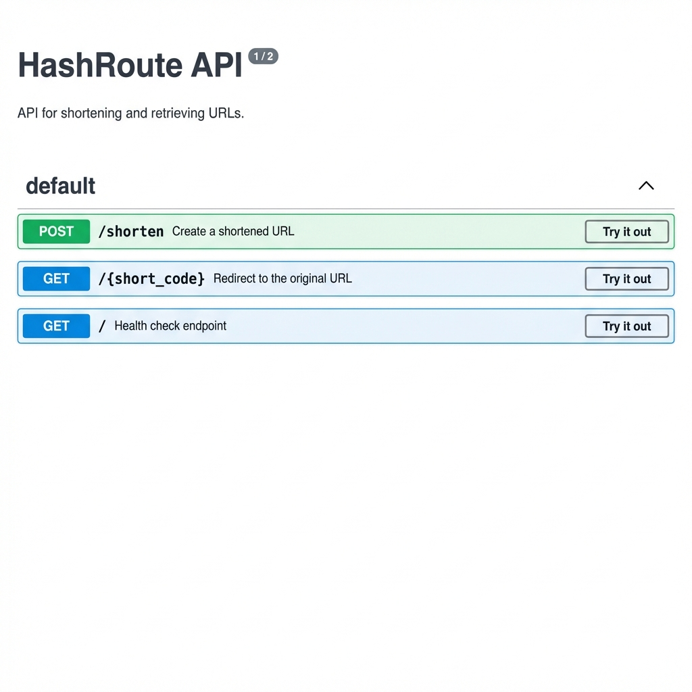
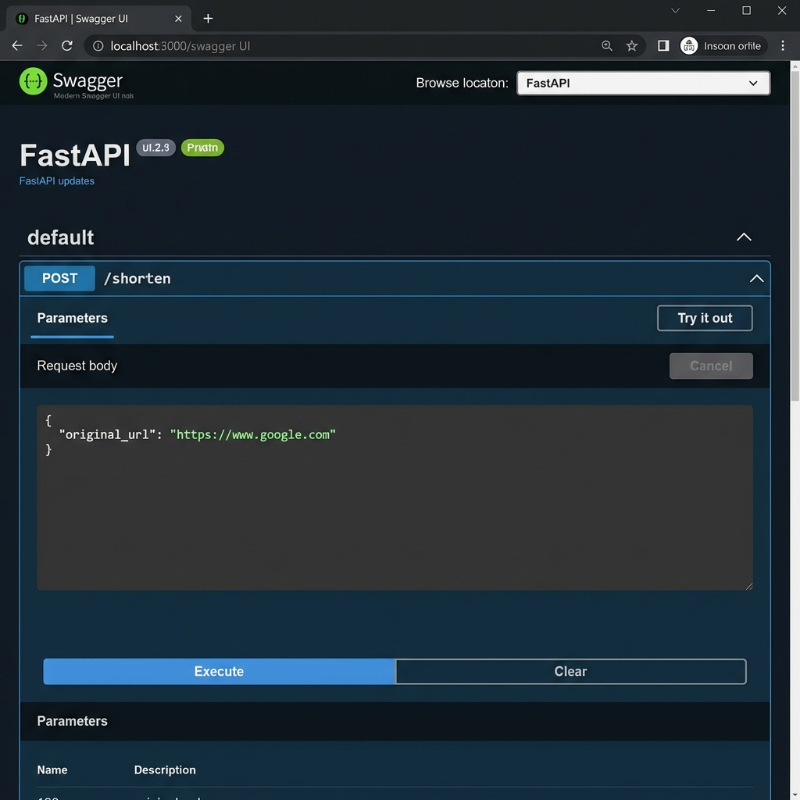
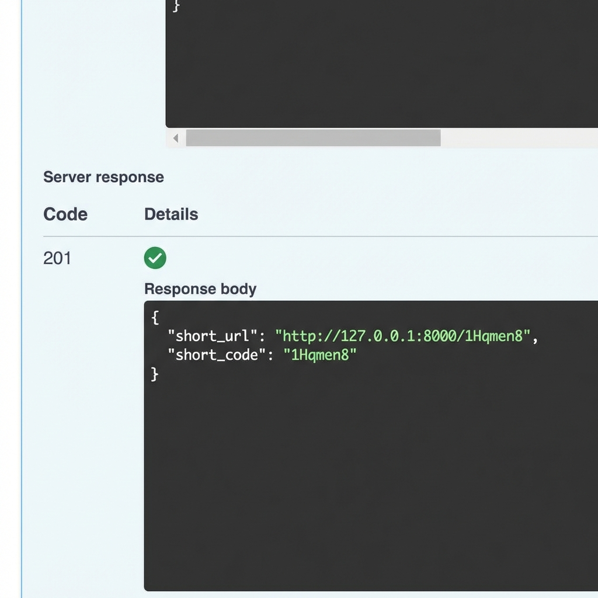
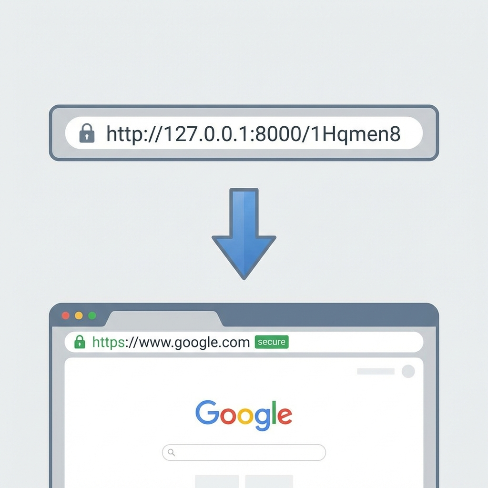

# HashRoute - URL Shortener API

HashRoute is a high-performance URL shortener backend service built with FastAPI and SQLAlchemy. It implements an industry-standard layered architecture focusing on scalability, maintainability, and clean separation of concerns.

## Overview
HashRoute provides a robust API to transform long, complex URLs into short, human-readable codes. The system uses a collision-resistant hashing strategy combined with Base62 encoding to ensure unique, reliable short links.

## Architecture
The project follows a layered backend architecture reviewed and approved by senior engineering standards:

- **API Layer**: Handles HTTP protocols, request/response validation, and routing.
- **Service Layer**: Decoupled business logic including URL hashing and collision resolution.
- **Data Layer**: Manages persistence via SQLAlchemy with optimized B-Tree indexing on short codes.
- **Utility Layer**: Stateless helper functions for encoding and hash generation.

## Project Structure
```text
HashRoute/
├── app/
│   ├── api/                # Routers and endpoints
│   ├── models/             # Database ORM models
│   ├── schemas/            # Pydantic request/response schemas
│   ├── services/           # Core business logic
│   ├── utils/              # Helper utilities
│   ├── config.py           # Centralized settings and environment config
│   ├── database.py         # Database connection and session management
│   └── main.py             # Application entry point
├── assets/                 # Static assets and screenshots
├── docs/                   # System design, architecture, and walkthrough
├── tests/                  # Automated test suite (pytest)
├── requirements.txt        # Project dependencies
└── verify_api.py           # End-to-end verification script
```

## How to Run Locally

### Prerequisites
- Python 3.10+
- SQLite (default) or PostgreSQL/MySQL

### Setup
1. Clone the repository and navigate to the root directory.
2. Create and activate a virtual environment:
   ```powershell
   py -3.10 -m venv venv
   .\venv\Scripts\activate
   ```
3. Install dependencies:
   ```powershell
   pip install -r requirements.txt
   ```
4. Configure environment variables (optional):
   ```powershell
   copy .env.example .env
   ```

### Execution
Start the production-ready server using Uvicorn:
```powershell
uvicorn app.main:app --reload
```

## Testing & Verification

### Automated Tests
Run the professional test suite using `pytest`:
```powershell
pytest tests/
```

### End-to-End Verification
A specialized script is provided to validate the system end-to-end:
```powershell
python verify_api.py
```
This script validates:
1. Service health and connectivity.
2. Successful URL shortening and storage.
3. Proper HTTP 307 Redirection.
4. Idempotency (Same URL returns the same short code).
5. 404 handling for non-existent routes.

## API Demo

### Swagger Documentation
Access the interactive OpenAPI documentation at `http://127.0.0.1:8000/docs`.



### Shortening a URL
Submit a `POST` request to `/shorten` with the original URL.



### API Response
The system returns a unique 7-character short code and the full resolution URL.



### Redirection Flow
Navigating to the short URL automatically redirects the client to the original destination while incrementing analytics.


