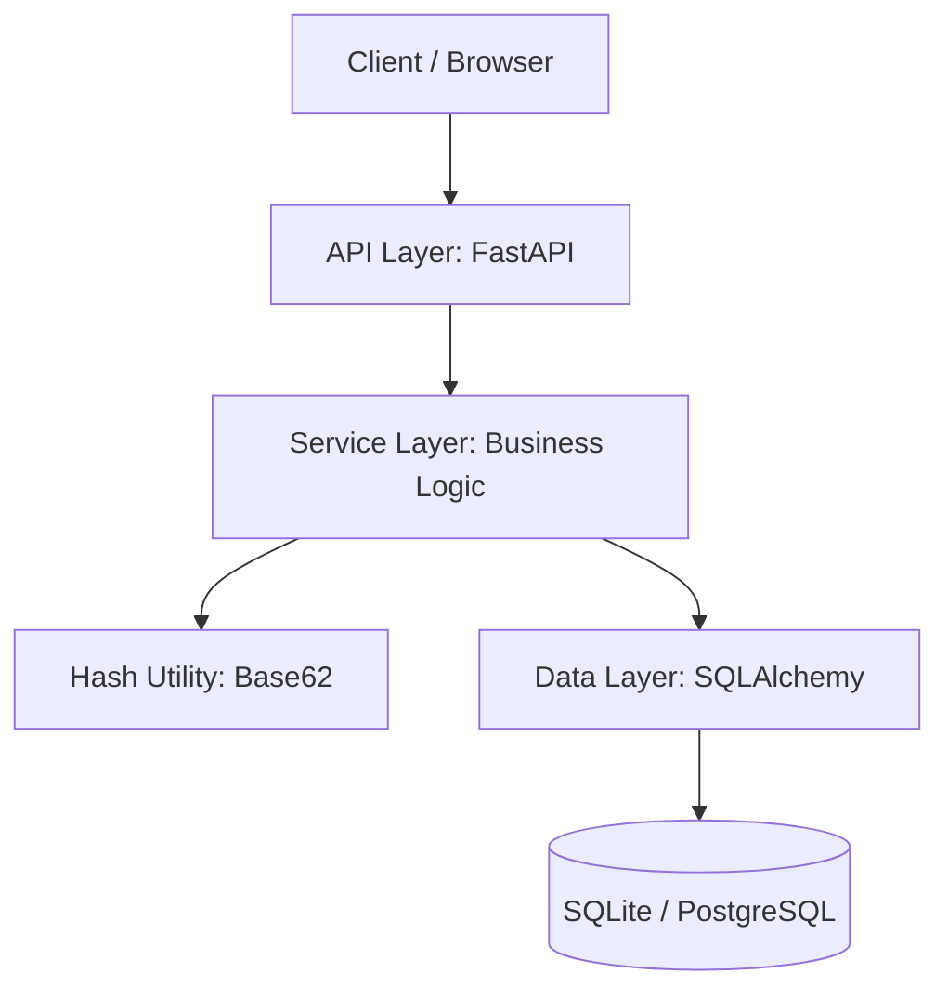

<div align="center">
  <h1>🚀 HashRoute</h1>
  <p><strong>High-Performance URL Shortener API</strong></p>

  <a href="https://fastapi.tiangolo.com"></a>
  <a href="https://www.sqlalchemy.org"></a>
  <a href="https://www.python.org"></a>
  <a href="LICENSE"></a>

  <br><br>
  
  <a href="https://thesakshidiggikar.github.io/HashRoute/">
    
  </a>

  <p><em>Premium Backend Documentation & Interactive Showcase</em></p>
</div>

---

## 📖 Introduction

**HashRoute** is a production-grade URL shortener backend built with **FastAPI** and **SQLAlchemy**. It implements an industry-standard layered architecture focusing on **scalability**, **maintainability**, and **clean separation of concerns**.

> [!NOTE]  
> This repository includes a **Premium Documentation Website** (available via GitHub Pages) that features a modern dark theme and interactive concept demos.

---

## 🏗 System Architecture

HashRoute follows a strict layered pattern to ensure business logic is decoupled from external interfaces.



- **API Layer**: Handles HTTP protocols, request/response validation (Pydantic), and routing.
- **Service Layer**: Decoupled domain logic including hashed short-code generation and collision resolution.
- **Data Layer**: Manages persistence with optimized **B-Tree indexing** on short codes for constant-time lookups.
- **Utility Layer**: Pure, stateless helper functions for Base62 encoding.

---

## 📂 Project Structure

```text
HashRoute/
├── app/
│   ├── api/                # Routers and endpoints
│   ├── models/             # Database ORM models
│   ├── schemas/            # Pydantic validation
│   ├── services/           # Business logic
│   ├── utils/              # Base62 & Hashing
│   ├── config.py           # Environment config
│   ├── database.py         # DB connection
│   └── main.py             # Entry point
├── website/                # Premium Static Demo Site (Vite)
├── tests/                  # Pytest suite
└── verify_api.py           # E2E Verification Script
```

---

## ⚡ Quick Start

### 1. Setup
```bash
# Clone and enter
git clone https://github.com/thesakshidiggikar/HashRoute.git
cd HashRoute

# Create Virtual Env
python -m venv venv
source venv/bin/activate  # Or .\venv\Scripts\activate on Windows

# Install
pip install -r requirements.txt
```

### 2. Run API
```bash
uvicorn app.main:app --reload
```

---

## 🧪 Verification & API Demo

### Automated Testing
```bash
pytest tests/
```

### End-to-End Logic
The `verify_api.py` script validates the following:
- [x] Service health and connectivity.
- [x] URL shortening & storage.
- [x] **HTTP 307 Redirection**.
- [x] **Idempotency** (Same URL = Same Code).
- [x] 404 handling for invalid routes.

---

## 🎨 Interactive Showcase
For a visually polished experience with **Dark Mode** and **Interactive Simulations**, visit the [HashRoute Project Website](https://thesakshidiggikar.github.io/HashRoute/).

- **Dark Theme Interface** (Vite + Vanilla CSS)
- **Live Concept Demo** (Mock Hashing Workflow)
- **Mobile Responsive Layout**
- **Copy-to-Clipboard Functionality**

---
<div align="center">
  <p>Engineered for High-Performance by <a href="https://github.com/thesakshidiggikar">Sakshi Diggikar</a></p>
</div>
